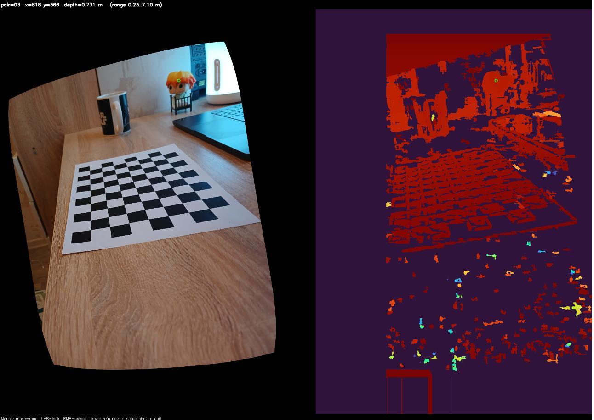
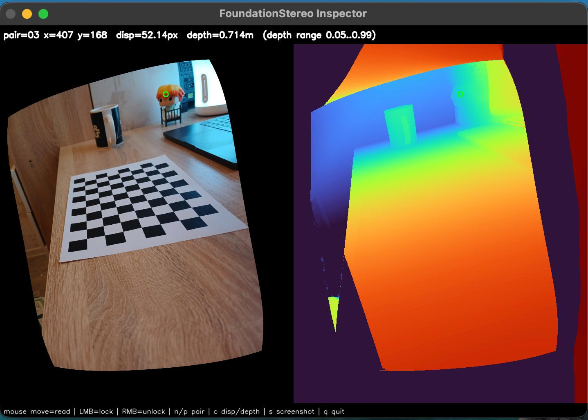
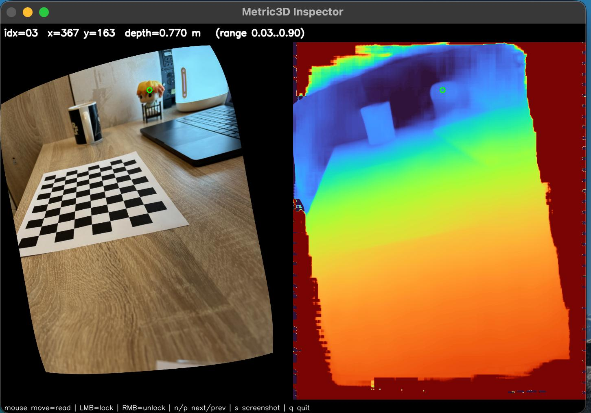

# Stereo assignment: depth from two phones (classic stereo + FoundationStereo + Metric3D)

This repo is a practical pipeline for building **depth (including metric depth)** from two phone cameras using:

* **Stereo calibration + rectification (OpenCV)**
* **Classic stereo (SGBM + optional WLS filtering)**
* **Neural stereo (NVLabs FoundationStereo)**
* **Neural mono depth (Metric3D via Hugging Face ONNX)**

Outputs include:

* rectified image pairs
* disparity maps
* depth maps (meters where possible)
* interactive inspectors (click to read depth)

---

## 0) Preparation

### 0.1 Clone repositories

```bash
cd stereo_assignment

# Metric3D (optional: full repo, useful for research/extra code)
git clone https://github.com/YvanYin/Metric3D

# FoundationStereo (neural stereo)
git clone https://github.com/NVlabs/FoundationStereo
```

### 0.2 Install and activate FoundationStereo environment (IMPORTANT)

Follow **FoundationStereo repo instructions** to create the conda environment, then activate it:

```bash
conda activate foundation_stereo
```

> All neural scripts (FoundationStereo + your integrated pipelines) should be run inside this environment unless you intentionally made a separate env.

---

## 1) Shooting guide (this matters a lot)

### 1.1 Physically connect the phones (rig)

For stable stereo geometry:

* clamp the two phones together (rig, tripod mount, tape + rigid plate)
* keep the cameras parallel
* avoid any movement between phones during calibration and scene capture

### 1.2 Turn OFF phone processing

Disable anything that breaks pixel consistency between left/right:

* HDR / Smart HDR
* night mode
* portrait mode / bokeh
* scene optimizer / AI enhancement
* digital stabilization
* autofocus hunting (ideally lock focus)
* auto exposure changes (ideally lock exposure/ISO)
* auto white balance changes (ideally lock WB)

### 1.3 Prefer RAW if possible

If the phones support RAW/DNG:

* RAW is better for calibration and matching
* less sharpening/denoise/tone mapping → more stable geometry

### 1.4 Chessboard photos (calibration set)

Use a calibration checkerboard (print or rigid display).
Chessboard source:
[https://markhedleyjones.com/projects/calibration-checkerboard-collection](https://markhedleyjones.com/projects/calibration-checkerboard-collection)

Shoot 10–30 pairs:

* vary distance (close/medium/far)
* vary rotation/tilt
* cover corners + edges of frame
* avoid blur and reflections

### 1.5 Add a known test object (recommended)

Put a ruler/box/bottle at a **known distance** in some chessboard shots.
Then right after calibration you can click the object and validate metric depth.

---

## 2) Calibrate + rectify photos

Folder layout:

```
stereo_assignment/
  left/   (1.jpg ... N.jpg)
  right/  (1.HEIC or 1.jpg ... N.*)
```

Run:

```bash
python3 ./src/calib_and_rectify.py
```

Outputs:

* `rectified_photos/left/`
* `rectified_photos/right/`
* `rectified_photos/*_calibration_opencv.yml`
* `rectified_photos/stereo_calibration_opencv.yml`

Quality metrics:

* `left_reproj_rmse`, `right_reproj_rmse`
* `stereo_rms`
  Lower is better.

---

## 3) Classic stereo (OpenCV SGBM) + inspection

Run:

```bash
python3 ./src/classic_stereo.py
python3 ./src/classic_inspector.py
```

---

## 4) Neural stereo (FoundationStereo) + inspection

### 4.1 Run FoundationStereo on rectified pairs

```bash
python3 ./src/neural_stereo.py
```

macOS/MPS tips (optional):

```bash
PYTORCH_ENABLE_MPS_FALLBACK=1 XFORMERS_DISABLED=1 python3 ./src/neural_stereo.py
```

### 4.2 Inspect

```bash
python3 ./src/neural_inspector.py
```

---

## 5) Mono neural depth (Metric3D ONNX / Hugging Face) + inspection

### 5.1 Important: weights are downloaded automatically by the script

The mono script uses Hugging Face and **downloads the ONNX weights automatically on first run** using `huggingface_hub.hf_hub_download()`.

So you **do not need to download Metric3D weights manually** for this pipeline.

Run:

```bash
python3 ./src/neural_mono.py
```

### 5.2 Changing the model / weights

If you want to use a different Metric3D ONNX model (or fp16 variant), you must edit the **constants at the top of the script**, for example:

* `HF_MODEL_ID = "onnx-community/metric3d-vit-large"`
* `HF_ONNX_PATH_FP32 = "onnx/model.onnx"`
* `HF_ONNX_PATH_FP16 = "onnx/model_fp16.onnx"`
* `USE_FP16_MODEL = False`

To switch weights, you change `HF_MODEL_ID` and/or the ONNX filename constants.

### 5.3 Inspect mono results

```bash
python3 ./src/mono_inspector.py
```

---

## 6) Compare results + conclusions

Compare:

* **Classic stereo**: good on textured areas, weak on shiny/low-texture/occlusions
* **Neural stereo**: usually best matching, but heavy compute on Mac
* **Mono (Metric3D)**: works with one image, can look great; metric scale depends on correct intrinsics

---

## Common pitfalls / tips

* Don’t change zoom / focal length after calibration.
* Keep the rig fixed between calibration and tests.
* If depth scale is off by ~2×:

  * check if you resized inputs but didn’t scale `fx`
  * ensure you use rectified intrinsics (`P1/P2`) when appropriate
* If process runs out of memory:

  * reduce inference resolution
  * reduce iterations / disable hierarchical inference

---

## Example results


